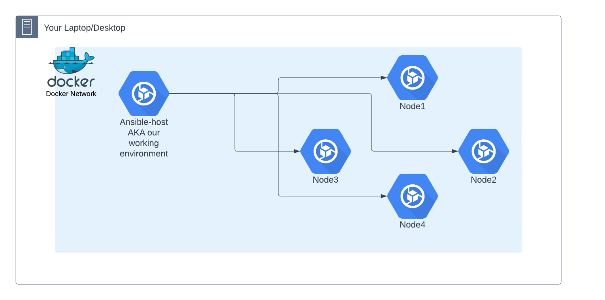

# Ansible Class Task

- Create bash script that determines Linux Distro based on os-release file in `/etc` folder
- Use ansible to copy script to all servers in inventory file
- Run the script on all the servers in the inventory file

## Table Of Contents

- [Prerequisites](#prerequisites)
- [Usage](#usage)
- [Script](#script)
- [Installation](#installation)
- [Contributing](#contributing)

## Prerequisites
1. Linux Debian distribution
2. python 3.5 or later (python ≥ 3.6 is recommended) and pip are installed
3. Docker environment installed (docker-compose)
4. Ansible installed

## Usage 
In this task, we create an environment of four different nodes, each with a different OS and an Ansible host node. 
The bash script created will check which Linux distrobution is installed in each node. 
The task will be preformed by ansible playbook connecting and runnig the task on each node. 

## Script 
''' #!/bin/bash '''

''' # Read the /etc/os-release file ''' 
''' source /etc/os-release '''

''' # Print the distro information ''' 
''' echo "The distro is: ${PRETTY_NAME}" '''

## Installation 
### Updating, upgarding and installing in linux debian: 

1. ''' sudo apt update '''
2. ''' sudo apt-get upgrade '''
3. ''' sudo apt install python3-pip '''
4. ''' sudo apt install docker-compose '''
5. ''' ansible --version '''
   * check ansible installed and version 

### Uploading Docker nodes: 

6. ''' mkdir -p task/ansible/docker '''
   * created the folder for the task  
7. ''' git init '''
8. ''' git clone https://github.com/ethan-yadan/ansible-docker.git '''
   * clone files to local repository
9. ''' docker-compose up -d && docker-compose logs -f '''
   * uploading docker nodes
10. ''' docker ps '''
   * checking nodes created and running

### run task on nodes with Ansible: 

11. ''' sudo mkdir -p /etc/ansible '''
   * Create folder for ansible configuration file 
12. ''' sudo mv task/ansible/docker/ansible.cfg /etc/ansible '''
   * Moving the ansible.cfg file from the cloned repository to /etc/ansible
13. 
